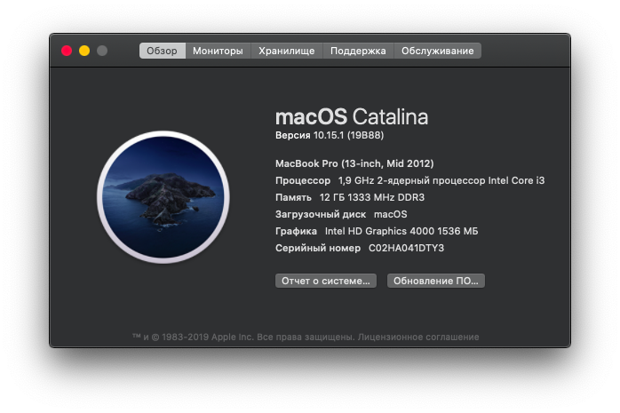

# Hackintosh EliteBook Folio 9470m

## Configuration

| Specifications | Detail                                                  |
| ------------------- | ------------------------------------------- |
| Processor | Intel Core i3-3227U, 1900 MHz (19 x 100) |
| Memory | SK hynix HMT351S6CFR8C-H9 / Kllisre KRE-D3S1600M/8G |
| Hard Disk | WEIJINTO mSATA SSD 480 Gb |
| Integrated Graphics | Intel(R) HD Graphics 4000 |
| Monitor | 1366 x 768 (14.0 inch) |
| Sound Card | IDT 92HD91BXX |
| Ethernet | Intel 82579LM |
| Wireless Card | Intel (R) Centrino (R) Advanced-N 6235 (replaced by AC7260)|
| Trackpad | Synaptics SMBus TouchPad |
| SD Card Reader | JMicron PCIe SD/MMC |

## BIOS Settings
First of all, upgrade your BIOS to "68IBD Ver. F.73
  
- Match your BIOS setting with the pictures gives below:
  - Boot Options: [Photo 1](https://github.com/md-siam/Hackintosh_EliteBook_Folio_9470m/blob/master/images/Boot_Options/IMG_1393.JPG), [Photo 2](https://github.com/md-siam/Hackintosh_EliteBook_Folio_9470m/blob/master/images/Boot_Options/IMG_1394.JPG), [Photo 3](https://github.com/md-siam/Hackintosh_EliteBook_Folio_9470m/blob/master/images/Boot_Options/IMG_1395.JPG)
  - Device Configuration: [Photo 1](https://github.com/md-siam/Hackintosh_EliteBook_Folio_9470m/blob/master/images/Device_Configurations/IMG_1396.JPG), [Photo 2](https://github.com/md-siam/Hackintosh_EliteBook_Folio_9470m/blob/master/images/Device_Configurations/IMG_1397.JPG), [Photo 3](https://github.com/md-siam/Hackintosh_EliteBook_Folio_9470m/blob/master/images/Device_Configurations/IMG_1398.JPG), [Photo 4](https://github.com/md-siam/Hackintosh_EliteBook_Folio_9470m/blob/master/images/Device_Configurations/IMG_1399.JPG)
  - AMT Options: [Photo 1](https://github.com/md-siam/Hackintosh_EliteBook_Folio_9470m/blob/master/images/AMT_Options/IMG_1401.JPG)

## Screen

